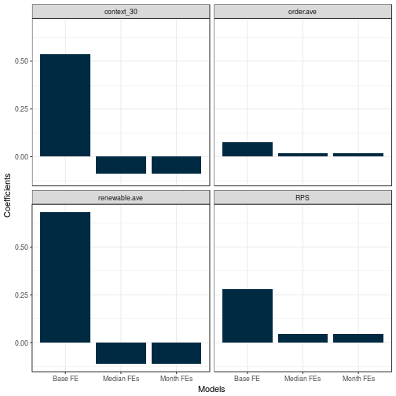

<!-- Loading Required packages -->

<!-- Refering to a different stylesheet-->
<head>
  <link rel="stylesheet" href="assets/css/white.css">
</head>

<!-- Front Page -->
## Reverberation and Energy Policy in the United States
         

<small>Emma Heffernan & Devvart Poddar</small>

--- &vertical

## Introduction
 

<ul style="list-style-type:square" class="wrapper">
  <li>
    <small>
      Rising electricity costs in developed nations has become the political topic <i>du jour</i>
      across OECD jurisdictions. The cost of electricity matters: the impact of rising electricity
      costs is felt most acutely by low-income individuals
    </small>
  </li>
   
  <li class="fragment">
    <small>
      Much of the blame for rising electricity prices has been levied against government
      renewable energy policies. Past reserach has found a link between renewable energy policies and increased energy prices.
    </small>
  </li>
   
  <li class="fragment">
    <small>
      We argue that as the federal energy court gives more legitimacy to renewable
      energy policies and goals, this increased legitimacy will result in the implementation
      of more renewable energy policies in states and thereby marking up the price.
    </small>
  </li>
</ul>

***

## Theoretical Framework
 

<ul style="list-style-type:square" class="wrapper">
  <li>
    <small>
      Previous studies have focused exclusively on either state level policies or national enforcement to
      explain changes in prices, without considering the interactions between the two.
    </small>
  </li>
   
  <li class="fragment">
    <small>
      Robert Putnam (1988): <b>Two-level games</b>. Theorises the concept of reverberation; <i>"lnternational pressures can
      reverberate within domestic politics”</i>  subsequently altering the
      position of domestic civic society groups
    </small>
  </li>
   
  <li class="fragment">
    <small>
      We will use a modified version of this theory to model how the federal and state spheres interact in the United States
    </small>
  </li>
</ul>

--- &vertical

## Data & Method
 

<ul style="list-style-type:square" class="wrapper">
  <li>
    <small>
      Data sourced from multiple web sources. We get data on renewable electricity prices
      from EIA for all states (except Hawaii) and for a time period of 15 years
    </small>
  </li>
   
  <li class="fragment">
    <small>
      We use the presence of Renewable Portfolio Standards (RPS) using data from <thead>
      study by Hongbo Wang (2014)
      </thead>
    </small>
  </li>
   
  <li class="fragment">
    <small>
      Finally we measure federal level policies in terms of their enforcement and focus on
      renewable energy standards. We get this from the Federal Energy Regulatory Commission
      (FERC) for 2001 onwards.
    </small>
  </li>
</ul>

***

### Seasonal Trend in Prices;

  <video width=""  controls loop><source src="assets/fig/plottrend-.webm" />
video of chunk plottrend
</video>

***

### Distilling Text

<small> <b>What it looks like before;</b> </small>

  
 <small> 10. The Tribe argues that PacifiCorp is not taking action to obtain water quality
  certification and thus is not diligently pursuing its license application.8
   The Tribe
  therefore asks the Commission to dismiss the relicense application and require the
  company to file a plan to decommission the project.9
  11. We agree with the Tribe that the circumstances of this case are far from ideal.
  As noted above, Commission staff issued the EIS in November 2007. The Commission
  could act on PacifiCorp’s application but for the absence of water quality certification.10
  The Klamath Project is operating under the terms of the 1954 license, and, as a result, the
  many environmental benefits that could accrue under the new license have not
  occurred.11 Under the express terms of the Clean Water Act, however, the Commission  </small> 

<small> <b>What it looks like after; </b> </small>

 <small>  tribe argue Pacificorp take action obtain water quality certification thus diligently pursue license application tribe therefore ask commission dismiss relicense application require company file plan decommission project agree tribe circumstance case far ideal noted commission staff issue Eis November commission act pacificorps application absence water quality certification klamath project operate term license result many environmental benefit accrue new license occur express term clean water act however commission  </small> 

--- &vertical

## Variables; A snapshot
  

<table id='minimal' style='width:100% text-align:center;'>  <tr><th style='text-align:center'>  </th> <th style='text-align:center'>Prices</th> <th style='text-align:center'>RPS</th> <th style='text-align:center'>Deregulation</th> <th style='text-align:center'>Freq. of Order</th> <th style='text-align:center'>Freq. of Renewable</th> <th style='text-align:center'>Context; Renewable</th> <th style='text-align:center'>Temperature</th></tr> <tr'><td style='text-align:center' data-th='  '>Mean</td> <td style='text-align:center' data-th='Prices'>10.73</td> <td style='text-align:center' data-th='RPS'>0.43</td> <td style='text-align:center' data-th='Deregulation'>0.33</td> <td style='text-align:center' data-th='Freq. of Order'>1.52</td> <td style='text-align:center' data-th='Freq. of Renewable'>0.15</td> <td style='text-align:center' data-th='Context; Renewable'>0.11</td> <td style='text-align:center' data-th='Temperature'>91.97</td></tr> <tr'><td style='text-align:center' data-th='  '>Median</td> <td style='text-align:center' data-th='Prices'>10.16</td> <td style='text-align:center' data-th='RPS'>0</td> <td style='text-align:center' data-th='Deregulation'>0</td> <td style='text-align:center' data-th='Freq. of Order'>1.41</td> <td style='text-align:center' data-th='Freq. of Renewable'>0.08</td> <td style='text-align:center' data-th='Context; Renewable'>0.08</td> <td style='text-align:center' data-th='Temperature'>89.5</td></tr> <tr'><td style='text-align:center' data-th='  '>Min</td> <td style='text-align:center' data-th='Prices'>4.95</td> <td style='text-align:center' data-th='RPS'>0</td> <td style='text-align:center' data-th='Deregulation'>0</td> <td style='text-align:center' data-th='Freq. of Order'>0.11</td> <td style='text-align:center' data-th='Freq. of Renewable'>0.01</td> <td style='text-align:center' data-th='Context; Renewable'>0</td> <td style='text-align:center' data-th='Temperature'>2</td></tr> <tr'><td style='text-align:center' data-th='  '>Max</td> <td style='text-align:center' data-th='Prices'>23.08</td> <td style='text-align:center' data-th='RPS'>1</td> <td style='text-align:center' data-th='Deregulation'>1</td> <td style='text-align:center' data-th='Freq. of Order'>2.51</td> <td style='text-align:center' data-th='Freq. of Renewable'>0.42</td> <td style='text-align:center' data-th='Context; Renewable'>0.31</td> <td style='text-align:center' data-th='Temperature'>185</td></tr> <tr'><td style='text-align:center' data-th='  '>Unit</td> <td style='text-align:center' data-th='Prices'>$</td> <td style='text-align:center' data-th='RPS'>-</td> <td style='text-align:center' data-th='Deregulation'>-</td> <td style='text-align:center' data-th='Freq. of Order'>% point</td> <td style='text-align:center' data-th='Freq. of Renewable'>% point</td> <td style='text-align:center' data-th='Context; Renewable'>% point</td> <td style='text-align:center' data-th='Temperature'>&#x2109</td></tr> <tr'><td style='text-align:center' data-th='  '>Source</td> <td style='text-align:center' data-th='Prices'><a href=https://www.eia.gov/>EIA</a></td> <td style='text-align:center' data-th='RPS'><a href=https://mpra.ub.uni-muenchen.de/59165/1/MPRA_paper_59165.pdf>Wang (2014)</a></td> <td style='text-align:center' data-th='Deregulation'><a href=http://www.electricchoice.com/map-deregulated-energy-markets>electricchoice.com</a></td> <td style='text-align:center' data-th='Freq. of Order'><a href=https://ferc.gov/>FERC</a> (PDFs)</td> <td style='text-align:center' data-th='Freq. of Renewable'><a href=https://ferc.gov/>FERC</a> (PDFs)</td> <td style='text-align:center' data-th='Context; Renewable'><a href=https://ferc.gov/>FERC</a> (PDFs)</td> <td style='text-align:center' data-th='Temperature'><a href=https://www.ncdc.noaa.gov/>NOAA</a></td></tr> </table>
    
<small style="font-size:0.5em;"> <b>Note:</b> CSS sourced from <a href="https://github.com/psych-git/psych-git.github.io">psych-git</a></small>

--- &vertical

## Results
  

  

--- &vertical

## Discussion and Next steps
 

<ul style="list-style-type:square" class="wrapper">
  <li>
    <small>
      <b>2SLS Regression: </b> A key step would be to undertake a 2 stage regression; impact of federal rulings on the probability of implementing the RPS policy
    </small>
  </li>
   
  <li class="fragment">
    <small>
      We also find a conradiction between state policies and federal rulings. If federal rulings on renewable energy redce electricity prices, why do RPS policies increase them?
    </small>
  </li>
   
  <li class="fragment">
    <small>
      Finally we look at only federal rulings due to easier data availablity and collection. However it would be important to look at state level policies as well in future studies.
    </small>
  </li>
</ul>

--- &vertical

        
## Thanks!
